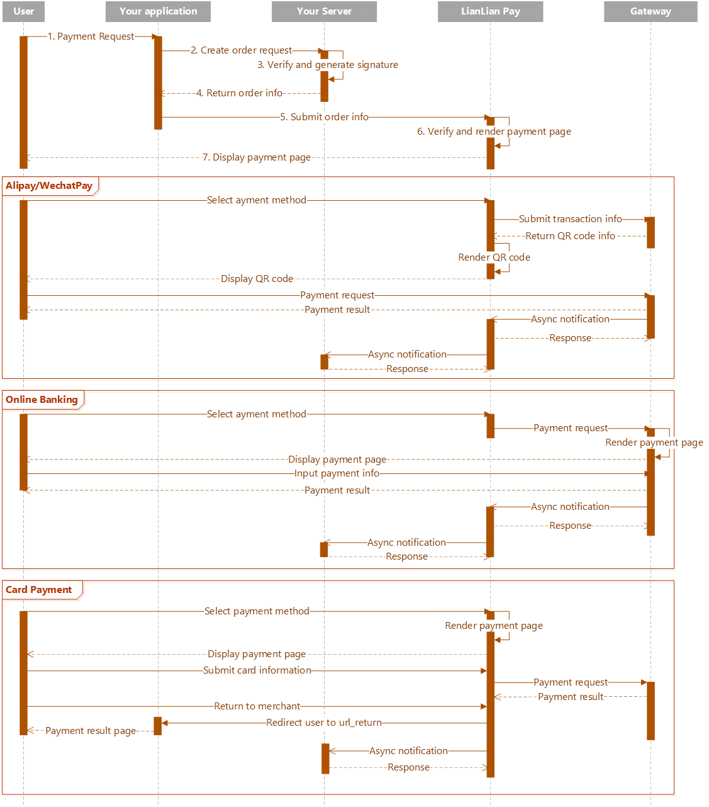
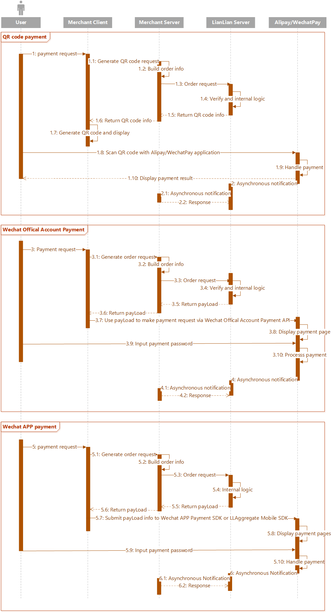

# Aggregate Payment

Aggregate Payment allows you to accept payments with a single integration for below payment methods:

* **Card payment**. Users provide their key payment information such as card number, phone number, ID card number, real name etc to get verified and complete payments.
* **Online banking payment**. Users are redirected from your sites to pages hosted by selected banks, proceed payments and then return to your sites. 
* **Alipay**. Users scan QR code which is displayed in pages hosted by LianLian after being redirected from your sites.
* **WechatPay**. Similar to Alipay.

All above payment methods are available by redirecting your users to pages hosted by LianLian via [aggregate payment redirect API](aggregate-web-redirect.md). For WechatPay and Alipay, [aggregate payment direct API](aggregate-direct-api.md) is also available. Refer to [Aggregate Payment Flow](#aggregate-payment-flow) for more details. 

***

## Aggregate Payment Flow

### Aggregate Payment Redirect API

Below is a typical UML sequence diagram for the interactions with Aggregate Payment Redirect API.

### Aggregate Payment Direct API

Below is a typical UML sequence diagram for the interactions with Aggregate Payment Direct API.

LianLian will proceed with the payment request and communicate with our gateways to obtain the payment result once the payment request is executed. Whenever its status confirmed as successful, LianLian sends out the [Aggregate payment asynchronous notification](aggregate-asyn-notification.md) immediately to your server. You can then verify the HTTP request and then proceed with your delivery logic.
