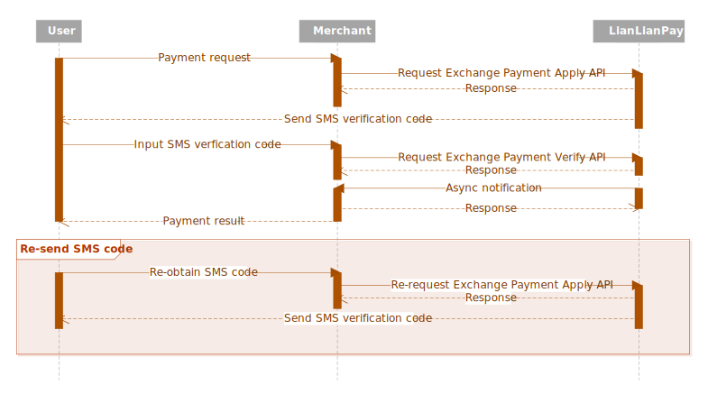

# Exchange Payment Overview

Exchange Payment is a card payment solution that enable the capability of Chinese customers to make payment in CNY for goods which is sold in [other currencies](docs/supported-currencies.md). It makes oversea purchase possible for China domestic customers who only have cards issued by [Union Pay Organization](http://www.unionpayintl.com/en/).

Typically, by using Exchange Payment your customer only need to provide below four key payment elements and do a SMS verification step:

* **Card number**. The used card number for debit card. If a credit card is used, **expiration date** and **CVV/CVC code** are additionally required.

* **ID card number**. The ID card number of customer.

* **Phone number**. The phone number which is saved in the card issuer of customer.

* **Real name**. Customer's full name.

Only 2 APIs are required to implement this feature:

1. [Exchange Payment Apply API](exchange-payment-apply-api.md) to create transaction and send SMS verification code.

2. [Exchange Payment Verify API](exchange-payment-verify-api.md) to verify the SMS verification code and proceed the transaction.

***

## Flow

Below is a typical UML sequence diagram for the interactions of Exchange Payment.

Whenever your customer has finished the verification step, LianLian will proceed with the payment request and communicate with our gateways to obtain the payment result. Once it is confirmed as a successful transaction, LianLian sends out the [Exchange Payment asynchronous notification](exchange-payment-async-notification.md) immediately to your server. You can then verify the HTTP request and then proceed with your delivery logic.

> A SMS verification code is only available for 10 min. To re-send it, you can simply re-do the request to [Exchange Payment Apply API](exchange-payment-apply-api.md), after that a new code would be sent out.

