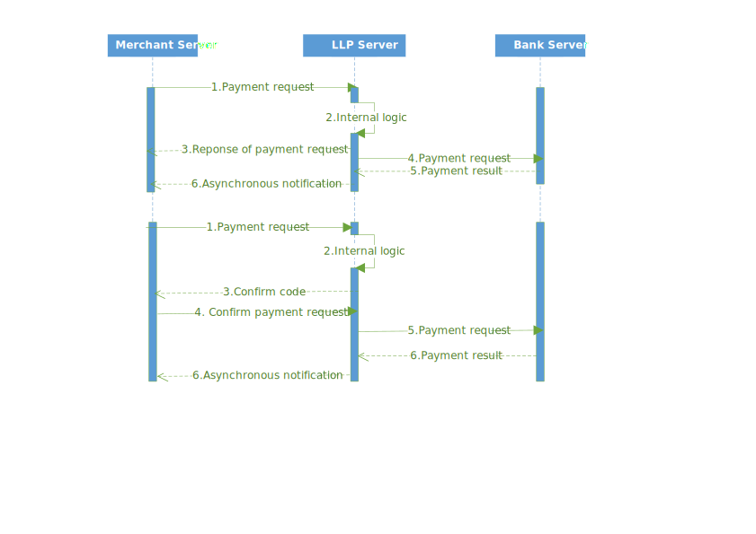

# Instant payment

Instant payment refers to the payment method that transfer money from you merchant account to the bank account you designated almost in real time.

Instant payment support two types of bank account.
* Personal debit card
* Business bank settlement accounts

***

## Preparatory work

* Ensure your merchant account have configured the right of this product.
* Make sure your merchant account has sufficient balance available.
* Add your source IP addresses to the LLP whitelist.

## Integration

Normally, you just need to request the [instant payment apply API](instant-payment-apply-API.md) to do the transfer. In the following cases, you need to judge if needed to continue. If so, please request the [instant payment confirm API](instant-payment-confirm-API.md) within 24h and LLP would do the transfer. If NOT, just ignore it.

* Suspected duplicate order. Within 24h, if you request to transfer money to the same bank account twice or more, it's the suspected duplicate order from the second order and need to 

* The account name does not match the card number.  

## Reference

[support bank list in json format](https://github.com/LianLianPay/Resources/blob/master/%E4%BB%98%E6%AC%BE%E7%B1%BB%E4%BA%A7%E5%93%81%E6%94%AF%E6%8C%81%E9%93%B6%E8%A1%8C%E8%A1%A8/instant-pay-support-bank-list.json)

***
###### Common Receiving Banks
|bank_code|Chinese bank name|bank name|
|:---|:---|:---|:---|
|01020000|	工商银行	|ICBC(Industrial and Commercial Bank of China)|
|01050000|	建设银行	|CCB(China Construction Bank)                 |
|01030000|	农业银行	|ABC(Agricultural Bank of China)	          |
|03080000|	招商银行	|CMB(China Merchants Bank)                    |
|03010000|	交通银行    |BCM(Bank of Communications)	              |
|03100000|	浦发银行    |SPDB(Shanghai Pudong Development Bank)	      |
|03060000|	广发银行    |CGB(China Guangfa Bank)	                  |
|01040000|	中国银行	|BOC(BANK OF CHINA)                           |
|03030000|	光大银行	|CEB(China Everbright Bank)                   |
|01000000|	中国邮储银行|PSBC(Postal Savings Bank of China)           |
|03050000|	民生银行	|CMBC(China Minsheng Banking Group,.Ltd)      |
|03020000|	中信银行	|CCB(CHINA CITIC BANK)                        |
|04031000|	北京银行	|BOB(Bank of Beijing)                         |
|03070000|	平安银行	|PAB(PingAn Bank)                             |
|03040000|	华夏银行	|HXB(Hua Xia Bank Co)                         |
