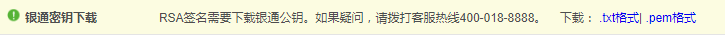

# Key Configuration

In this section, you will learn about how to generate your private key and public key. We use [openssl](https://www.openssl.org/) to generate keys.

***

## Generate private key

```html
openssl genrsa -out rsa_private_key.pem 1024
```
A file named ```rsa_private_key.pem``` should be generated in your current folder. 

The following steps are required for Java and C#, if you are using PHP, you can continue with [Generate public key](#generate-public-key).

Convert ```rsa_private_key.pem``` in the format of PKCS8.

```html
openssl pkcs8 -topk8 -inform PEM -in rsa_private_key.pem -outform PEM -nocrypt
```

Remove the header, footer, line breaks of the output and save it. E.g.

```html
MIICdgIBADANBgkqhkiG9w0BAQEFAASCAmAwggJcAgEAAoGBALrnBQVM/VUTaECLW/VaMfJK4Lb6WZaL6Iy6MYWr0D4rSk3VU/33LvubRPUQAylWUpT8sgaHb2bkPl+1+DAvAELoR+2yIGRNq6X6oqAR/Drv/b6MOokzEGq9KxOQM44aRHgwBEbDTt1IWFIj241A5WBJpmrLLnyKAZm7jTmCmITpAgMBAAECgYBFuxlZb+74RcRYiGXntR37WspaGi9AhrRdhL4jNAX+m+IeBeBPWWCTCMwCblXvn0AyS9ETtIXwqmlHBjoxp+d9atLEyFN2GMu811gvfWTrK2LKQxO+eo5ulpJKuSAQkpz7bZzq5ByG8vlT8QZ+YKCp/7XCHto2PHtA2YO7CeR8gQJBAPL64oEfRsEi+NxOYN7mBeUPEcH1HCQ9hBcVaatSzWcdnJP/MCcL7V7Y02zwCJQxBSIbU5d/5brCEtVzMWLGupECQQDE6uHCzk+aWx1trioOAiwegENL7jy3E40cJ7ie8OvkP/mJZpbjNjSBefpsY/semzjBwd77hJKH0+SIpB/KTmDZAkB23e+DFYbqoy41sI5JXSRTG50nUr7Sp9l/5XTNYHOl12GrMTMgVwBn3xEHgSHhRV3qgo3RVrtPMvQ9wd3OIcRRAkBZucTg5Oz0omvIXEGhXHAJ/dusL4POz8POfnLrSU/TEyt65hn+seY+0PvAg9Ya3hOAhfw6ku/JoE1TzaUGo6wRAkEAr4e9y/swoH7SiDtuvCNHLha2sSDdmNVDWzWpvGNiomST17W2UuXxaLmFPZB5+Jd3bGndppYFsVKAD6Qf3ECBHQ==
```

***

## Generate public key and upload it to LianLian dashboard

```html
openssl rsa -in rsa_private_key.pem -pubout -out rsa_public_key.pem
```

In your current folder, a file named ```rsa_public_key.pem``` should be generated. Open it and you will get something like this:

```html
-----BEGIN PUBLIC KEY-----
MIGfMA0GCSqGSIb3DQEBAQUAA4GNADCBiQKBgQC65wUFTP1VE2hAi1v1WjHySuC2
+lmWi+iMujGFq9A+K0pN1VP99y77m0T1EAMpVlKU/LIGh29m5D5ftfgwLwBC6Eft
siBkTaul+qKgEfw67/2+jDqJMxBqvSsTkDOOGkR4MARGw07dSFhSI9uNQOVgSaZq
yy58igGZu405gpiE6QIDAQAB
-----END PUBLIC KEY-----
```

Remove the header, footer, line breaks.

```html
MIGfMA0GCSqGSIb3DQEBAQUAA4GNADCBiQKBgQC65wUFTP1VE2hAi1v1WjHySuC2+lmWi+iMujGFq9A+K0pN1VP99y77m0T1EAMpVlKU/LIGh29m5D5ftfgwLwBC6EftsiBkTaul+qKgEfw67/2+jDqJMxBqvSsTkDOOGkR4MARGw07dSFhSI9uNQOVgSaZqyy58igGZu405gpiE6QIDAQAB
```

Upload it to [merchant dashboard](https://b.lianlianpay.com/trader/login.htm).


***

## Obtain LianLian public key

Go to [merchant dashboard](https://b.lianlianpay.com/trader/login.htm) and obtain the file whose name is ```llpay_public_key.pem```.

