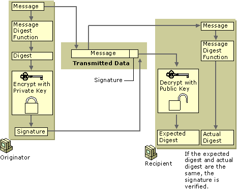

# Signature

Signature is the only criterion for determining data authenticity between you and LianLian. We support [RSA digital signature][1] with ```MD5withRSA``` algorithm in key size 1024, 2028 or 4096 to implement the signature process.

[1]: https://en.wikipedia.org/wiki/RSA_(cryptosystem)



> This process is from [Microsoft documents, RSA Data Security Digital Signature Process][2]

[2]: https://docs.microsoft.com/en-us/previous-versions/windows/it-pro/windows-2000-server/cc962021(v%3dtechnet.10)#rsa-data-security-digital-signature-process

There are two sets of public and private keys, one from merchant and another one is from LianLian in the whole verification process:

* When you **submit request to our server**, you need to build the signature source and encrypt it with your ```private key``` to generate signature. After receiving your requests, we decrypt the signature with your ```public key``` and then check the authenticity. 

* When you **receive notifications from our server**, you need to obtain the signature and parameters in our requests first, and then verify them with the ```public key``` provided by us.