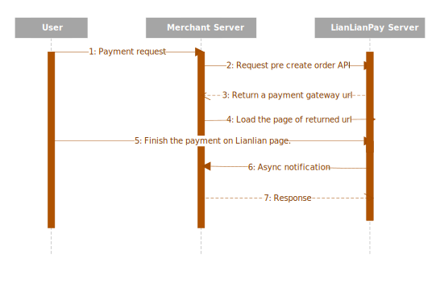

# Unified gateway payment

Unified gateway payment API provides a convenient and secure access mode for merchants. It supports merchants to request payment creation at server side. So no matter what the client side(web or wap) is, it is applicable.


***

## payment process



* Merchant requests payment creation API at server side. Lianlian will return a payment page url for merchant to dispay.
* For card payment, the user finishs payment at Lianlian payment page.
* For online banking payment, users login online banking system and pay online.(If bank code is NOT null, the user will be redirected to online banking payment.)
* Process the notificaton and update the payment status.

***

## Implement


1. [Request payment](online-banking-redirect-api.md)  Redirect your user to Lianlian payment page.
   
2. [Synchronous Notification(optional)](sync-notification.md)  Lianlian will send synchronous notification to the ```url_return``` after the payment is confirmed as successful.

3. [Asynchronous Notification](aggregate-asyn-notification.md)  After the payment is successful, the result of the payment will be notified to your server. 

***

